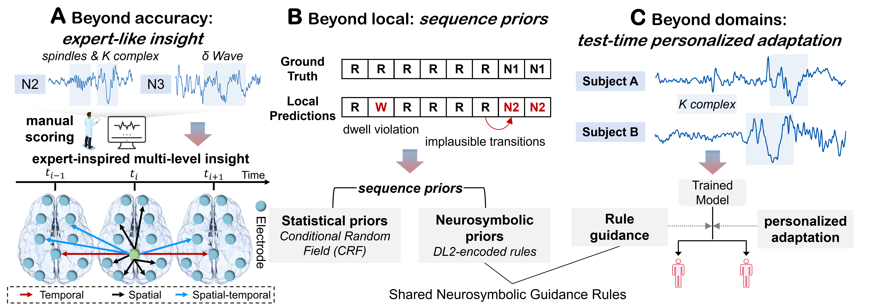
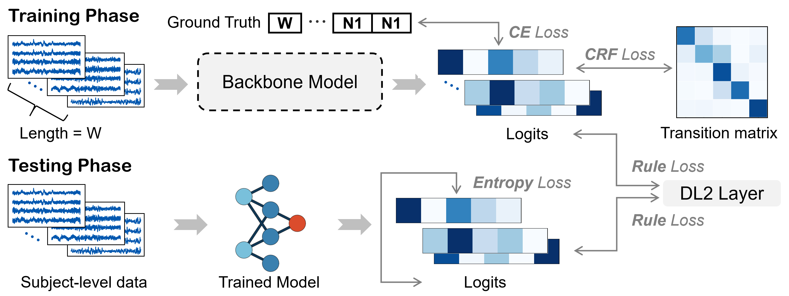
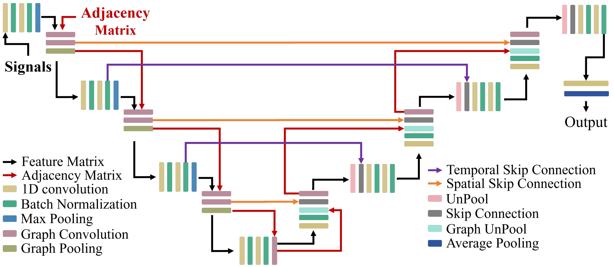
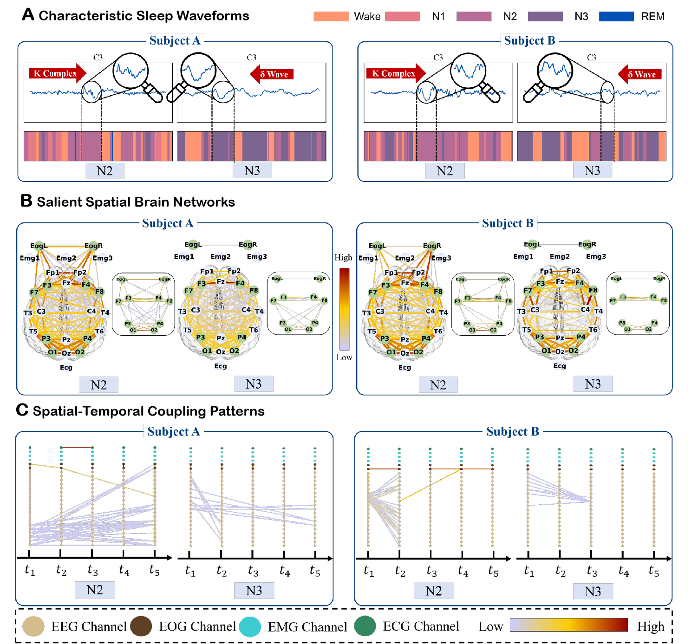

# [npjAI 2026] LogicSleep: a neurosymbolic-guided framework for explainable and personalized sleep staging

This repository is the official implementation of the npjAI 2026 paper *LogicSleep: a neurosymbolic-guided framework for explainable and personalized sleep staging.*

## Introduction

**LogicSleep** is a neurosymbolic framework that integrates physiological transition rules with deep learning to enable explainable, physiologically plausible, and subject-adaptive sleep staging.

- **Multi-level explainability:** Extracts characteristic sleep waveforms, salient spatial brain networks, and spatial–temporal coupling patterns from raw polysomnography.
- **Physiologically grounded personalization:** Combines statistical and symbolic sequence priors with rule-guided test-time adaptation to produce plausible, subject-specific predictions.
- **A substantial extension of our previous work:** LogicSleep advances [ST-USleepNet](https://www.ijcai.org/proceedings/2025/0466) from local sleep-stage prediction to neurosymbolic sequence modeling, personalized adaptation, and broader cross-dataset evaluation. 



## Methodology





## Visualization



## Getting Started

After entering the **LogicSleep** folder, follow these steps to run the code:

1. Train the backbone model with prior sequence

   ```bash
   python src/main.py
   ```

2. Perform personalized test-time adaptation on the trained model

      ```bash
      python src/main_tta.py

## Notes

- Please make sure all required dependencies are installed.
- Paths and configurations can be adjusted in the respective training scripts.

## Acknowledgement

We gratefully acknowledge the authors of [Graph U-Nets](https://github.com/HongyangGao/Graph-U-Nets) and [Tent](https://github.com/DequanWang/tent) for their open-source implementation.

## Reference

If you find this work helpful, please cite:

```bibtex
@inproceedings{ma2025st,
  title={ST-USleepNet: a spatial-temporal coupling prominence network for multi-channel sleep staging},
  author={Ma, Jingying and Lin, Qika and Jia, Ziyu and Feng, Mengling},
  booktitle={Proceedings of the Thirty-Fourth International Joint Conference on Artificial Intelligence},
  pages={4182--4190},
  year={2025}
}

@article{ma2026logicsleep,
  title={LogicSleep: a neurosymbolic-guided framework for explainable and personalized sleep staging},
  author={Ma, Jingying and Lin, Qika and Wu, Feng and Xing, Yucheng and Jia, Ziyu and Feng, Mengling},
  journal={npj Artificial Intelligence},
  year={2026},
  publisher={Nature Publishing Group UK London}
}
```
